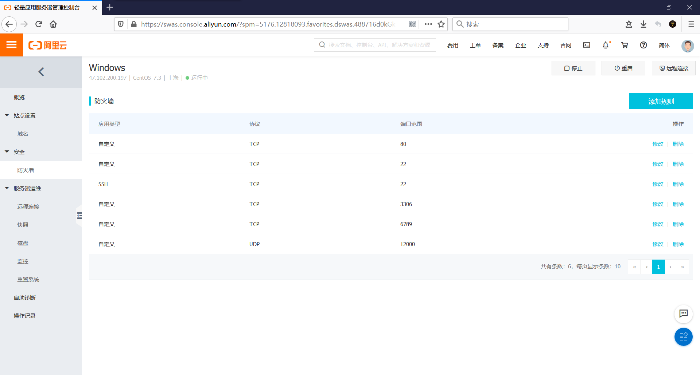

# socket - Web服务器

### 服务端

阿里云服务器

### CentOS 安装 python3

[为CentOS安装python3](https://www.jianshu.com/p/7c2b62c37223)

### 启动服务端

**语法：**python3 **py文件名**

```
python3 WebServer.py
```


如果你的文件放在根目录下,就先 `cd /.` 到根目录。

### 开放端口

我这里使用的端口是使用TCP协议的 6789端口，在阿里云控制台的防火墙开启即可。注意，没有开放端口，python 程序就无法监听到外来的消息。



### 终止服务端

**ctrl+c**

### 结果


