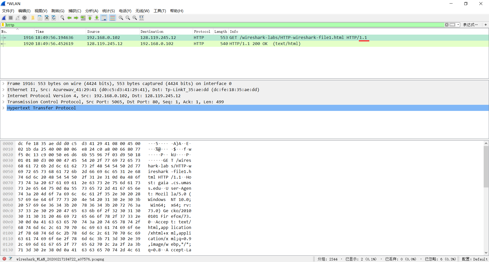
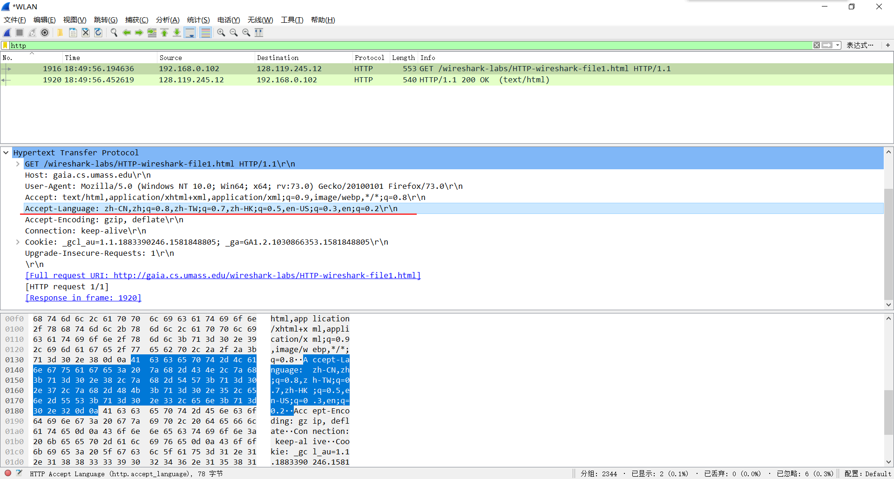
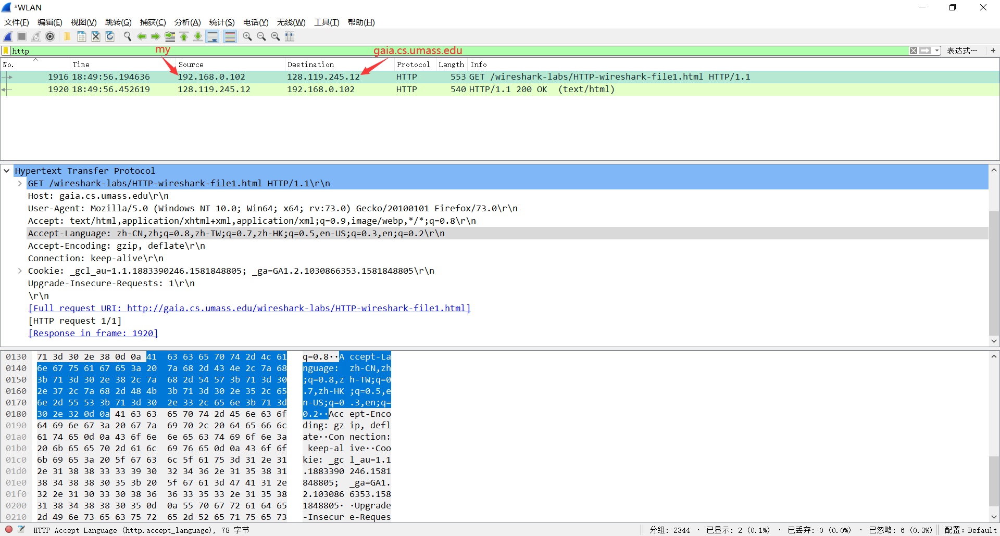
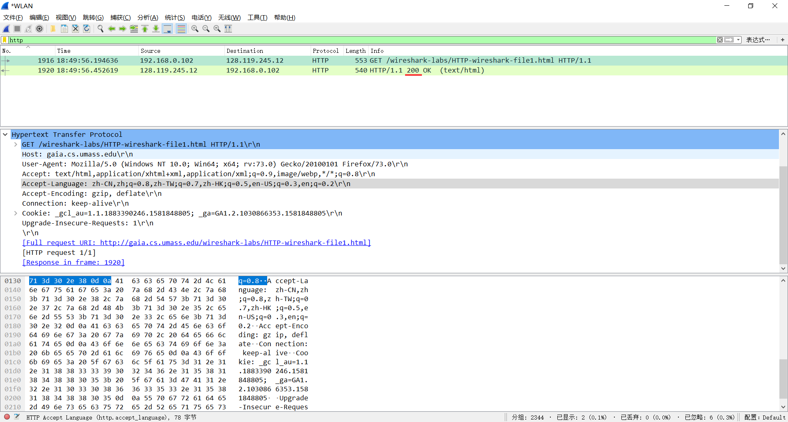
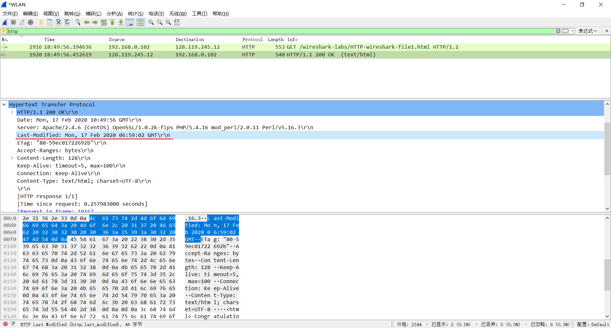
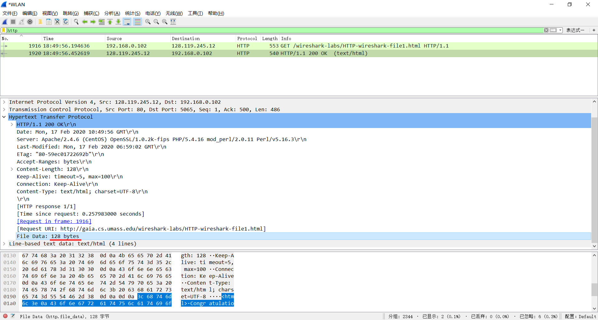

# 我的回答：Wireshark实验-HTTP

## 1. The Basic HTTP GET/response interaction

### 1.Is your browser running HTTP version 1.0 or 1.1? What version of HTTP is the server running?

### 2.What languages (if any) does your browser indicate that it can accept to the server?

### 3.What is the IP address of your computer? Of the gaia.cs.umass.edu server?

### 4.What is the status code returned from the server to your browser?

### 5.When was the HTML file that you are retrieving last modified at the server?

### 6.How many bytes of content are being returned to your browser?

### 7.By inspecting the raw data in the packet content window, do you see any headers within the data that are not displayed in the packet-listing window? If so, name one.

没有，仅有这条 HTTP 请求。