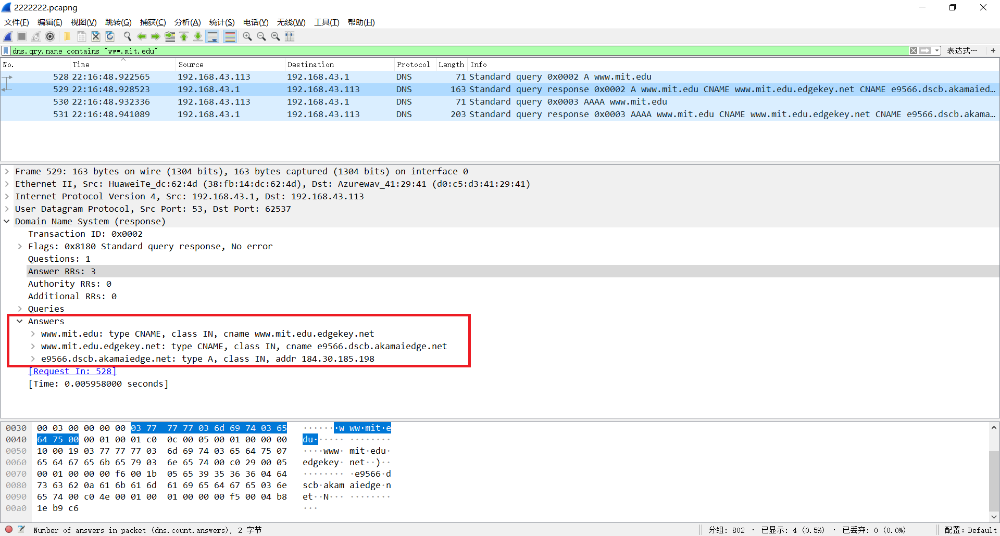

我的回答：Wireshark_DNS_v7.0

## 1. nslookup

### 1.Run *nslookup* to obtain the IP address of a Web server in Asia. What is the IP address of that server?

这里以 QQ 为例。

命令行中输入：

```
nslookup www.QQ.com
```

由图可知 www.QQ.com 地址为 **192.168.43.1**


### 2.Run *nslookup* to determine the authoritative DNS servers for a university in Europe.

这里以 <u>berklee.edu</u> 为例。

课文：*If Type=NS , then Name is a domain (such as foo.com ) and Value is the hostname of an authoritative DNS server that knows how to obtain the IP addresses for hosts in the domain.* 

这时，我们输入：

```
nslookup -type=NS berklee.edu
```

可见，<u>berklee.edu</u> 的权威域名服务器分别为：**ns4.p21.dynect.net、 ns2.berklee.edu、ns2.p21.dynect.net、ns1.p21.dynect.net、nameserver = ns3.p21.dynect.net**


### 3.Run nslookup so that one of the DNS servers obtained in Question 2 is queried for the mail servers for Yahoo! mail. What is its IP address?

我看了别人的解答：[实验四利用wireshark分析DNS]( https:/wenku.baidu.com/view/59a0d4fdaef8941ea76e05af.html)。依次输入

```
nslookup bitsy.mit.edu
```

```
nslookup www.yahoo.com bitsy.mit.edu
```

可以做到，不过我按照这篇文章去做时，做不出结果，因为老是超时。就得到了一个 bitsy.mit.edu 的地址。


这里我换成用 *8.8.8.8* 查 *mit.edu*

```
nslookup www.MIT.edu 8.8.8.8
```


## 2. ipconfig

### ipconfig -all

实验中的原文是 **ipconfig \all**，我这里是 win10，有所不同，用 ipconfig -all


### ipconfig /displaydns


### ipconfig /flushdns


## 3. Tracing DNS with Wireshark

### 4.Locate the DNS query and response messages. Are then sent over UDP or TCP? 

与实验里的不同，我在筛选器中填入的是 *ip.addr ==192.168.0.102 and dns* ，在后面加一个 dns ,更好地筛选出想要的结果。我检查了每一个抓到的报文，发现使用的都是 **UDP**。


### 5.What is the destination port for the DNS query message? What is the source port of DNS response message?

检查请求报文与其对应的响应报文可知，**都是53**。


### 6.To what IP address is the DNS query message sent? Use ipconfig to determine the IP address of your local DNS server. Are these two IP addresses the same? 

我的文件发到了两个地址，一个是 *192.168.0.1* ，一个是 *192.168.1.1* ，而我的 IP 地址是 192.168.0.102，它们并不一样。

### 7.Examine the DNS query message. What “Type” of DNS query is it? Does the query message contain any “answers”?

 **A** ：(Address) 记录是用来指定主机名（或域名）对应的IP地址记录。

**AAAA**：记录是用来指定主机名（或域名）对应的IPv6地址记录。

没有。


### 8.Examine the DNS response message. How many “answers” are provided? What do each of these answers contain?

三个，如下所示：

> www.ietf.org: type CNAME, class IN, cname www.ietf.org.cdn.cloudflare.net
>
> www.ietf.org.cdn.cloudflare.net: type A, class IN, addr 104.20.1.85
>
> www.ietf.org.cdn.cloudflare.net: type A, class IN, addr 104.20.0.85


### 9.Consider the subsequent TCP SYN packet sent by your host. Does the destination IP address of the SYN packet correspond to any of the IP addresses provided in the DNS response message?

**是**。

### 10.This web page contains images. Before retrieving each image, does your host issue new DNS queries? 

**没有**，因为本地有 DNS 缓存，直接使用缓存了。

<hr>

这里，我用：

```
dns.qry.name contains "www.mit.edu" 
```

过滤，因为 MIT 换了地址， *ip.addr == 192.168.2.145* 失灵了。此外，我换了个 WiFi ，本机地址变成了 *192.168.43.113*。

### 11.What is the destination port for the DNS query message? What is the source port of DNS response message?

**destination port for the DNS query message：53**

**source port of DNS response message：53**


### 12.To what IP address is the DNS query message sent? Is this the IP address of your default local DNS server?

发送到我电脑设置的公共 DNS 服务器 *192.168.43.1*，并不是我本地地址，我的本机地址是*192.168.43.113*。


### 13.Examine the DNS query message. What “Type” of DNS query is it? Does the query message contain any “answers”?

**A** type.

没有。

课文：*If Type=A , then Name is a hostname and Value is the IP address for the hostname. Thus, a Type*
*A record provides the standard hostname-to-IP address mapping. As an example,*
*(relay1.bar.foo.com, 145.37.93.126, A) is a Type A record.*


### 14.Examine the DNS response message. How many “answers” are provided? What do each of these answers contain?

三个。结果内容如图所示。



### 15.Provide a screenshot.

前面提供了一堆，这里就不提供了。

<hr>
下面用 

```
dns
```

过滤就可以了，要是跟上面一样，毛都没有。

### 16.To what IP address is the DNS query message sent? Is this the IP address of your default local DNS server?

发送到我电脑设置的公共 DNS 服务器 *192.168.43.1*，并不是我本地地址，我的本机地址是*192.168.43.113*。


### 17.Examine the DNS query message. What “Type” of DNS query is it? Does the query message contain any “answers”?

**NS** type.

没有。

课文：*If Type=NS , then Name is a domain (such as foo.com ) and Value is the hostname of an*
*authoritative DNS server that knows how to obtain the IP addresses for hosts in the domain. This*
*record is used to route DNS queries further along in the query chain. As an example, (foo.com,*
*dns.foo.com, NS) is a Type NS record.*


### 18.Examine the DNS response message. What MIT nameservers does the response message provide? Does this response message also provide the IP addresses of the MIT namesers?

提供了 MIT 的权威 DNS 的域名，如 Answers 所示。

不提供 MIT 域名的 IP 地址。


### 19.Provide a screenshot.

如上所示。

<hr>

bitsy.mit.edu (18.72.0.3) 这个 DNS，目前已经弃用。所以这里我用：

```
nslookup www.MIT.edu 8.8.8.8
```


### 20.To what IP address is the DNS query message sent? Is this the IP address of your default local DNS server? If not, what does the IP address correspond to?

发送查询信息到 ：*96.7.97.133* 。

不是。（发送查询信息的 DNS 服务器是 *8.8.8.8* ,我要是有这么牛逼的 IP 地址早就卖了换钱了）

发送查询信息的 DNS 服务器是 *8.8.8.8* 。


### 21.Examine the DNS query message. What “Type” of DNS query is it? Does the query message contain any “answers”?


PRT、A、AAAA.

三个都没有 answers.

### 22.Examine the DNS response message. How many “answers” are provided? What does each of these answers contain?

如图所示。


### 23.Provide a screenshot.

如上所示。


