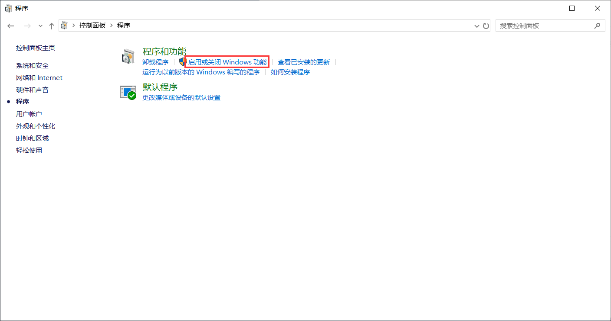

未完成原因：QQ需要授权才能发送邮件，否则邮件会被拒绝。这个不会弄


# 自顶向下方法 2.3.1：telnet 实验

## 开启 telnet client 

控制面板->点击程序->启用或关闭 Windows 功能




勾选 telnet client ,点击确定


打开命令行窗口，输入 **telent**  ,出现以下结果，说明可用。

```
telent
```


参考:[telnet用法 测试端口号](https://jingyan.baidu.com/article/7c6fb428d60c6e80642c90ee.html)

## 开始实验

这里用QQ邮箱做实验。打开命令行窗口，输入 **telnet smtp.qq.com 25** ，回车，之后出现如下窗口：

```
telnet smtp.qq.com 25
```


原文：

```
S: 220 hamburger.edu
C: HELO crepes.fr
S: 250 Hello crepes.fr, pleased to meet you
C: MAIL FROM: <alice@crepes.fr>
S: 250 alice@crepes.fr ... Sender ok
C: RCPT TO: <bob@hamburger.edu>
S: 250 bob@hamburger.edu ... Recipient ok
C: DATA
S: 354 Enter mail, end with ”.” on a line by itself
C: Do you like ketchup?
C: How about pickles?
C: .
S: 250 Message accepted for delivery
C: QUIT
S: 221 hamburger.edu closing connection
```


```
HELO crepes.fr
```

```
MAIL FROM: <1033027640@qq.com>
```

```
RCPT TO: <bob@hamburger.edu>
```

```
DATA
```


